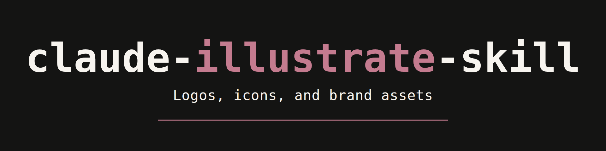

<p align="center">
  
</p>

# claude-illustrate-skill

> Design a logo without an image generator. Then look at it before you ship it.

  

---

## The Problem

You ask an AI for a logo. It hands back a 1024px PNG that looks great in the chat window. You drop it into a favicon slot and it turns to mud. You ask for an icon set and get twelve icons that look like twelve different studios made them. You need an SVG and you have a raster file that merely contains a picture of one.

The failure is not the model. It is that nobody looked at the result at the size it will actually be used, and nobody asked whether a diffusion model was the right instrument in the first place.

A logo that reads beautifully at 512px and turns to mud at 16px is not a logo, it is a picture of one. This skill renders every asset at its real sizes, opens the rendered pixels, critiques them against the brief, and revises. Claude can see images. This makes it use that.

---

## The part people are surprised by

**Logos and icons need no image backend at all.**

Vector marks are authored directly as SVG, rendered to PNG across the size ladder, inspected, and refined. No account, no API key, no vendor, no cost. That is the default track, not a fallback, and it covers most of what people mean when they ask for a logo.

A generation backend is only needed for **raster illustration**. That is a much narrower gap than "I need an AI to make images."

## Routing

| Asset class | Examples | Track |
|---|---|---|
| Vector mark | Logo, wordmark, favicon, app icon, UI icons | SVG. No backend. |
| Raster illustration | Hero images, character art, textures | Backend required |
| Composed layout | Social cards, README headers, one-pagers | Markup, not generation |

## Install

```bash
git clone https://github.com/code-katz/claude-illustrate-skill.git \
  ~/.claude/skills/illustrate
```

Cloning matters here: the backend guides and reference docs live in sibling files that `SKILL.md` reads on demand, so fetching `SKILL.md` alone gives you the SVG track but not the backend detail.

To update: `git -C ~/.claude/skills/illustrate pull`

## Use

It triggers on natural language. No command needed:

> "Design a logo for this project."
> "I need an icon set for the toolbar, 24px."
> "Make a hero image for the launch post."
> "Which AI tool should I use for a vector logo?"
> "Is this generated mark safe to trademark?"

## Backends (optional, for raster)

Setup, auth, endpoints, and gotchas for each are in [`backends/`](backends/).

| Backend | Best at | Notes |
|---|---|---|
| [Recraft](backends/recraft.md) | Vector logos and icons from a generator | The only one emitting true SVG paths. Its npm package is deprecated; use the remote server. |
| [Hugging Face](backends/hugging-face.md) | Raster illustration, free tier | Weakest text rendering. Volume needs PRO. |
| [Canva](backends/canva.md) | Editable layouts for non-engineers | Brand kits and autofill are **Enterprise-only**. |
| [Figma](backends/figma.md) | Mark to design system | A vector editor, not a generator. |

## Reference

- [`reference/manifest.md`](reference/manifest.md) — provenance record format. Every generated asset gets a row: backend, exact model, date, license, commercial-use status.
- [`reference/ip-and-licensing.md`](reference/ip-and-licensing.md) — copyright, trademark, and indemnification posture, and when to stop and get real legal review.

## Works well with

[claude-team-cli](https://github.com/code-katz/claude-team-cli) — seventeen named specialist personas. **Iris** (Brand & Illustration) is the persona this skill was built for: Iris brings the taste and the standards, this skill brings the mechanics.

## Prior art

Written from scratch, informed by four projects worth crediting. No text was copied from any of them; all three third-party repos are MIT licensed.

- **[neonwatty/logo-designer-skill](https://github.com/neonwatty/logo-designer-skill)** (MIT) — showed that a full logo workflow can run on directly authored SVG with no image backend, and that exporting across a size ladder is what surfaces failure. That insight is why the SVG track is the default here.
- **[designrique/ai-graphic-design-skill](https://github.com/designrique/ai-graphic-design-skill)** (MIT) — for framing backend choice as a per-task decision, and treating IP indemnification as a first-class selection criterion.
- **[jezweb/claude-skills](https://github.com/jezweb/claude-skills)** (MIT) — for the structured multi-part prompt approach, and the practical lesson that image APIs should be called from Python rather than shell.
- **Anthropic's `theme-factory` skill** — for the structure: a thin orchestrating `SKILL.md` with one data file per option, keeping vendor detail isolated in a single file.

## License

MIT. See [LICENSE](LICENSE).
