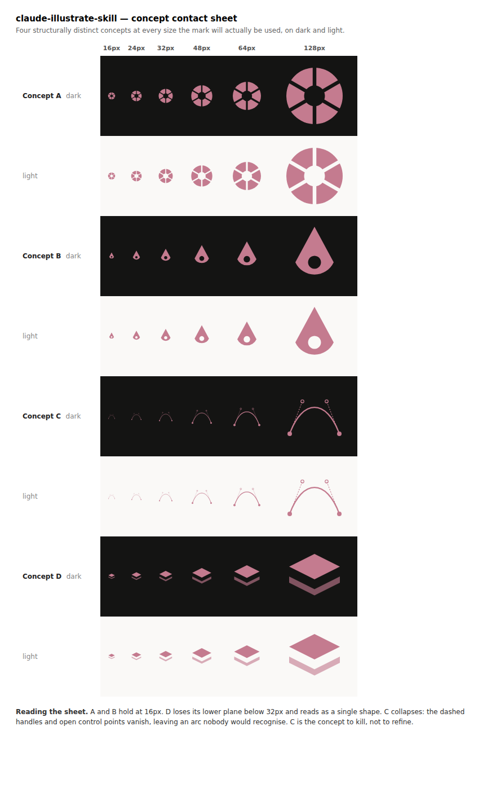

<p align="center">
  
</p>

# claude-illustrate-skill

> Design a logo without an image generator. Check it at 16 pixels before you ship it.

  

---

## The Problem

You ask an AI for a logo. You get back a 1024px PNG that looks great in the chat window. You drop it into the favicon slot and it turns to mud. You ask for a toolbar icon set and get twelve icons that look like twelve different studios drew them. You need an SVG, and what you have is a raster file with an `.svg` extension.

Then, months later, it gets worse in a quieter way. Someone asks which model made the logo, and whether its license covers commercial use, and nobody wrote it down.

None of this is a model failure. Nobody looked at the result at the size it will actually be used, and nobody asked whether a diffusion model was the right tool for a vector mark in the first place. A logo that reads beautifully at 512px and turns to mud at 16px is not a logo, it is a picture of one.

`illustrate-skill` fixes this. It routes each asset to the right method, renders every mark across its real size ladder, opens the rendered pixels, critiques them against the brief, and revises. Claude can see images. This skill makes it look.

**And for logos and icons, none of it needs an image generator.** Vector marks are authored directly as SVG: no account, no API key, no vendor, no cost. That is the default track, not a fallback, and it covers most of what people mean when they ask for a logo. A generation backend is only needed for raster illustration, which is a far narrower gap than "I need an AI to make images."

---

## Who This Is For

Developers and technically literate designers who need real brand assets for a project and do not have a designer on hand.

If you have ever shipped a favicon you never actually looked at, hand-traced a generated PNG because you needed a vector, or watched an icon set drift until no two icons looked related, this is for you.

It is also for anyone who will eventually have to answer "where did this asset come from, and can we use it commercially?" Every generated asset gets a provenance row at the moment it is produced, not in a cleanup pass six months later when the details are gone.

---

## See the Difference

You need a logo for a project, and it has to work as a favicon.

**Without the skill:**

> **You:** Design a logo for this project. It needs to work as a favicon.
>
> **Claude:** Here's a logo concept: a modern, minimalist mark with a clean geometric feel. *(1024x1024 PNG)*
>
> You can resize this down to 16x16 for your favicon.

**With the skill:**

> **You:** Design a logo for this project. It needs to work as a favicon.
>
> **Claude:** Favicon means 16px is the binding constraint, so before I draw anything: does it also have to survive being one flat color, and what is your palette in hex?
>
> *(then: four structurally distinct concepts authored as SVG, rendered across the size ladder on light and dark, assembled into one contact sheet)*

<p align="center">
  
</p>

> **Claude:** Reading the sheet: A and B hold at 16px. D loses its lower plane below 32px and reads as a single shape. C collapses entirely, because the dashed handles and open control points vanish and leave an arc nobody would recognize. C is the concept to kill, not to refine. A is the strongest: it survives one flat color and stays legible at every size. Its worst remaining problem is that the blade gaps close up at 16px, so I am widening them and re-rendering.

That sheet is real output from this skill, not a mockup. The concept sources are in [`examples/`](examples/).

Real SVG. Every size it will actually be used at. Looked at before delivery. No image generator involved, and no cost.

---

## What It Does

- **Routes by asset class first**, so a vector mark never gets sent to a diffusion model
- **Authors vector marks directly as SVG** with no image backend, no account, and no cost
- **Takes a brief before drawing**: smallest use size, single-color requirement, palette in hex, typography and its licenses, set membership
- **Produces 3 to 5 structurally distinct concepts**, not one idea in four colorways
- **Renders the full size ladder** into a single contact sheet, on light and dark
- **Reads the rendered pixels**, names the single worst failure rather than listing five, and revises
- **Caps iteration at three passes**, so a wrong concept gets called wrong instead of polished
- **Builds sets that match**, inspected together on one sheet rather than one file at a time
- **Records provenance for every generated asset**: backend, exact model, date, license, commercial-use status
- **Flags assets that cannot carry a provenance line** as unsafe to ship, rather than delivering them quietly
- **Connects an image backend only when raster illustration actually needs one**
- **Works with any project**, and triggers on natural language with no command to remember

---

## Asset Classes

The routing decision happens before any tool is chosen, because the right instrument differs completely across the three classes.

| Asset class | Examples | How it gets made |
|---|---|---|
| **Vector mark** | Logo, wordmark, favicon, app icon, UI icon set | SVG authored directly. No backend, no cost. The default, not a fallback. |
| **Raster illustration** | Hero images, character art, textures, photographic composites | A connected generation backend. |
| **Composed layout** | Social cards, README headers, badges, one-pagers | HTML/CSS or SVG written directly. Not a generation problem. |

Most requests that sound like "generate an image" are vector marks or composed layouts, and a diffusion model is the wrong instrument for both.

---

## What You Get

A logo request lands on disk looking like this:

```
assets/
├── logo-mark.svg           # the source, editable node by node
├── logo-mark-mono.svg      # single-color variant, when the brief calls for one
├── logo-mark-16.png        # the size ladder the project actually needs
├── logo-mark-32.png
├── logo-mark-512.png
└── contact-sheet.png       # every concept at every size, light and dark
```

Plus a row in `assets/MANIFEST.md` for anything a model touched:

| Asset | Backend | Model | Date | License | Commercial use | Prompt or source |
|---|---|---|---|---|---|---|
| `logo-mark.svg` | none | hand-authored SVG | 2026-07-28 | project | yes | Authored directly, no model |
| `hero-launch.png` | hugging-face | FLUX.1-schnell | 2026-07-28 | Apache-2.0 | yes | See `prompts/hero-launch.txt` |

`none` is a first-class value in the Backend column, not a gap. Hand-authored SVG has no third-party license question to resolve at all, which is part of why it is the default rather than the fallback.

---

## Installation

This skill is for [Claude Code](https://claude.ai/code). Install it once and it is available across all your projects.

```bash
git clone https://github.com/code-katz/claude-illustrate-skill.git \
  ~/.claude/skills/illustrate
```

Clone rather than curling a single file. The backend guides and reference docs live in sibling files that `SKILL.md` reads on demand, so fetching `SKILL.md` alone gives you the SVG track without the backend detail or the IP reference.

To update:

```bash
git -C ~/.claude/skills/illustrate pull
```

---

## Usage

Once installed, the skill activates automatically in Claude Code. There is no command to remember. It triggers on natural language:

> "Design a logo for this project."
>
> "I need an icon set for the toolbar, 24px."
>
> "Make a hero image for the launch post."
>
> "Which AI tool should I use for a vector logo?"
>
> "Is this generated mark safe to trademark?"

It will ask for the brief before it draws anything, and it will not invent values it was not given. If the project already has a brand file, it composes the brief from that instead of asking.

---

## Image Backends (optional)

Only raster illustration needs one. Logos, icons, favicons, wordmarks and composed layouts do not.

| Backend | Best at | Worth knowing |
|---|---|---|
| **[Recraft](backends/recraft.md)** | Vector logos and icons from a generator | The only one emitting true SVG paths rather than a raster approximation. Paid, per generation. Use the remote MCP server; the npm package is deprecated. |
| **[Hugging Face](backends/hugging-face.md)** | General raster illustration | Free tier, so no cost to try. Weakest text rendering of the four. Volume needs PRO. |
| **[Canva](backends/canva.md)** | Editable layouts a non-engineer will keep working on | Brand kits and template autofill are Enterprise-only, which is the most common wrong assumption about it. |
| **[Figma](backends/figma.md)** | Turning an approved mark into a design system | A vector editor, not a generator. |

Setup, auth, endpoints and per-vendor gotchas live in [`backends/`](backends/), read on demand rather than all at once.

If no backend is connected, the skill says so plainly instead of describing an image it cannot produce.

---

## Requirements

- macOS or Linux
- [Claude Code](https://claude.ai/code)
- `git` (the skill is cloned, not curled)
- A renderer for the SVG track: Chromium, already present in most Claude Code environments though often not on `PATH`, or `rsvg-convert`. If neither is found, the skill says so and inspects the SVG source rather than claiming a render it did not perform.
- An image generation backend (optional, and only for raster illustration)

---

## Works Well With

| Project | What it does | How it connects |
|---|---|---|
| [claude-team-cli](https://github.com/code-katz/claude-team-cli) | More than a dozen named specialist personas | Iris (Brand & Illustration) is the persona this was built for: Iris brings the taste and the standards, this brings the mechanics |
| [claude-devlog-skill](https://github.com/code-katz/claude-devlog-skill) | Structured development changelog | Records which concept was chosen and which were rejected, so the next session does not re-litigate the mark |
| [claude-roadmap-skill](https://github.com/code-katz/claude-roadmap-skill) | Living product roadmap | Brand work almost always hangs off a launch milestone |
| [claude-plans-skill](https://github.com/code-katz/claude-plans-skill) | Archives finalized implementation plans | The brief and the size ladder survive past the session that produced them |
| [claude-todo-skill](https://github.com/code-katz/claude-todo-skill) | Lightweight task scratchpad | Catches the assets you noticed you still need while working on something else |
| [claude-conductor](https://github.com/code-katz/claude-conductor) | Tracks parallel Claude Code sessions | Asset work runs in its own session alongside feature work |
| [claude-publish-agent](https://github.com/code-katz/claude-publish-agent) | Publish markdown to blogging platforms | The hero image and the post that needs it ship together |

---

## Repository Contents

| Path | Purpose |
|---|---|
| `SKILL.md` | The skill source: routing, the brief, the SVG track, the backend track |
| `backends/` | One file per image backend. Setup, auth, endpoints, gotchas. Read on demand |
| `examples/` | The concept sources behind the contact sheet above |
| `reference/manifest.md` | Provenance record format. One row per asset: backend, exact model, date, license, commercial-use status |
| `reference/ip-and-licensing.md` | Copyright, trademark and indemnification posture, and when to stop and get real legal review |
| `README.md` | This file |

---

## Prior Art

Written from scratch, informed by four projects worth crediting. No text was copied from any of them. All three third-party repos are MIT licensed.

- **[neonwatty/logo-designer-skill](https://github.com/neonwatty/logo-designer-skill)** (MIT) — showed that a full logo workflow can run on directly authored SVG with no image backend at all, and that exporting across a standard size ladder is what surfaces failure
- **[designrique/ai-graphic-design-skill](https://github.com/designrique/ai-graphic-design-skill)** (MIT) — for framing backend choice as a per-task decision rather than a single winner, and for treating IP indemnification as a first-class selection criterion
- **[jezweb/claude-skills](https://github.com/jezweb/claude-skills)** (MIT) — for the structured multi-part prompt approach
- **Anthropic's `theme-factory` skill** — for the structure used here: a thin orchestrating `SKILL.md` with one data file per option

---

## License

See [LICENSE](LICENSE) for details.
